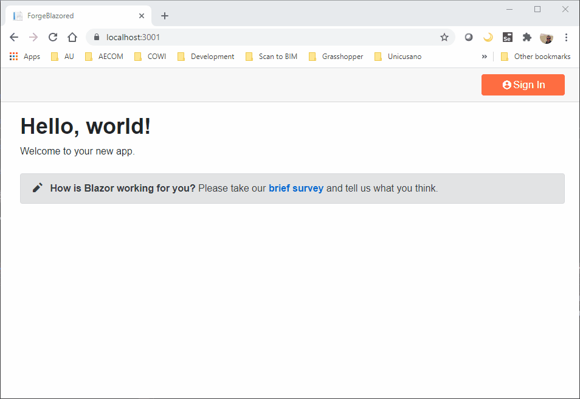

# ForgeBlazored
This application implements a three-legged authentication workflow in Autodesk Forge using Blazor Server-Side.

## Run it locally
Make sure you update the information in the [Configuration.cs](./ForgeBlazored/Services/ConfigurationManager.cs) file to match your Forge app client id, client secret and callback url
This project uses Radzen.Blazor to manage some of the UI components
